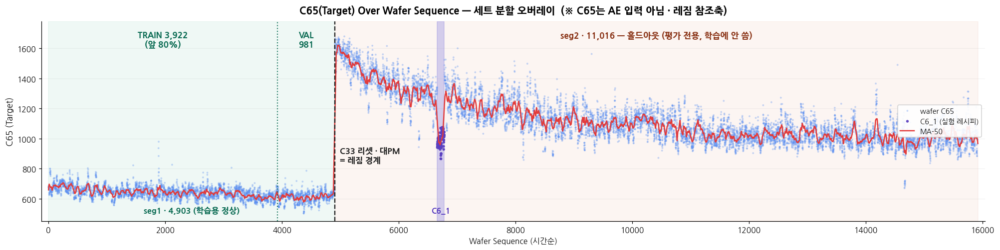

# AE(Autoencoder) 개발계획 v3 — EDA부터 모델링까지

> 작성: 2026-07-14 (기획 전용 문서 — 코드 없음). 작성 주체: Claude (A 트랙 지원).
> **단일 소스 참조**: `능동형_제조_AI_플랫폼_기획서_v4.5.md`(마스터) · `데이터_사전_v1.md`(v3.1) · `사이클_정의_v1.md`(사이클 세계관, 🔒동결) · `CLAUDE.md`(작업 규칙). 이 계획이 위 문서와 충돌하면 **위 문서가 우선**하며, 충돌 발견 시 본 문서를 개정한다.
> **확정된 전제 (2026-07-14 사용자 확인)**: ① 입력 표현은 **단계적 v1(집계 피처 AE) → v2(Step 4 시퀀스 AE)** ② EDA는 **AE 특화**(데이터 사전 결론 재활용) ③ 실행 환경 **GPU(CUDA) 보유**, CPU 폴백 병기.
> **개정 규칙**: 방침 변경 시 새 파일로 발행 (CLAUDE.md 버전 관리 정합). 진행 중 체크 표시·경미한 수치 확정은 본 문서에 갱신.
>
> ### 📌 v1→v2 개정 이력 (2026-07-14 · P1 EDA 실행·게이트 검출 후, 사용자 승인)
> P1 EDA(`ae_eda_v1`) 실행에서 §5-1 무결성 게이트가 **병합 손상**을 검출 → 진단 후 대응 3종을 계획에 반영(`ae_eda_v2`가 정식):
> 1. **병합 중복 `(C64,C7,C46)` 1,456행 제거(dedup, 시간순 첫값)** 를 표준 전처리에 추가 — 원본 '9~24행'의 15행 이상 141장(C6_0)은 전부 복제였고 정제 후 **9~14행**이 정상. (§2-1·§5-1 갱신)
> 2. **C41=C10−C39 게이트 판정을 반올림 허용(round)** 으로 — ±0.1~0.9초는 3초 격자·실수 경과시간 차이라 무해(데이터 사전 "100%"는 정수 기준). (§5-1 갱신)
> 3. **C65 wafer 상수 위반 378장(2.4%) 발견** → AE는 C65 입력 금지라 무영향(게이트 WARN), **A(김민지)·PM 통보**(`팀통보_병합무결성_20260714.md`). 데이터 사전 "C65 wafer 상수"와의 모순은 A 트랙 조사 회부. (§2-2·§5-1 갱신)
> 근거 스냅샷: `ae_eda_v1/REPORT/…_P1무결성게이트.md` · `ae_eda_v2/REPORT/…_P1설계확정.md`.
>
> ### 📌 v3 데이터 갱신 (2026-07-14 · 재병합본 `merged_data_v3.csv` 수령 — 방침 불변, 입력 교체)
> PM 재병합으로 **C65 오염 해소**(위반 378장 → 0 = "병합 오염" 확정) → **입력 파일을 `merged_data_v3.csv`로 교체**(정식, `ae_eda_v3`). 부수 변경: ① `split`(원본 3분할 메타) 컬럼 추가 → 드랍·금지입력 ② 타임스탬프 float화 → C41 게이트 ±1초 허용 ③ C40 datetime 복구(C10 중복이라 드랍 유지). **병합중복 1,456행은 원본 3조각 내부 복제라 잔존 → dedup 가드 유지, 소스 정제(조각별 dedup 후 병합)는 PM 권고**. §5-1 게이트 **완전 PASS(FAIL 0·WARN 0)**, DoD 5종 최종 확정. 근거: `ae_eda_v3/REPORT/ae_eda_v3_REPORT_01_P1설계확정.md`.
>
> ### 📌 v2→v3 개정 이력 (2026-07-16 · `AE_아키텍처_판단_v1.md` 반영 — 모델 후보군 재편)
> P1 실측(Step 4 정착 **p50=2·p90=2·max=3 → T=2**, DoD4)으로 시퀀스 AE의 전제(시간축 정보량)가 부정됨. G2 사전 등록 문서 `AE_아키텍처_판단_v1.md`(세그, 2026-07-16)의 판정을 계획에 편입:
> 1. **P5 전면 재편 (§9)**: Conv1D-AE·LSTM-AE는 **조건부 백로그**(재오픈 트리거 T1~T3)로 이동, v2 슬롯은 **flatten-MLP 축소 실행**(§5-4 분기 실측 발동)으로 확정. mock 증식으로 시퀀스 AE를 살리는 안은 **기각** — mock이 늘리는 건 N이지 T가 아니고, 이 플랫폼에서 mock의 정위치는 "학습이 아니라 채점"(판단 v1 Q1).
> 2. **보강 후보군 신설 (§9-2)**: 성능 투자 우선순위를 v1 계열 보강으로 재배치 — ⓐ 과도 모양 지표를 v1 피처로 등재(§6-2, 무조건 실행) ⓑ **진입 조건 발동 시에만** 실행하는 조건부 후보 3종(시드·피처-배깅 앙상블 / DAGMM-lite / MemAE-lite).
> 3. **G2 게이트 분화 (§7-3)**: G2a(flatten-MLP)·G2b(보강 후보) — 채택 기준 동일, G2b에 '설명성 유지' 조건과 라운드 cap 1.5일 추가.
> 4. **부록 A 갱신**: C54/C56 **과도 wafer-mean 재정정(7/13 — 정착→과도 복귀, B 자가 발견·PM 승인)** 반영, C11_wf_min 병합본 실측(+0.21σ — F14 +6.56σ 대비 약함) 주석.
> 5. **일정 리베이스 (§13)**: 7/16 기준 — P0·P1 완료(✅), P5b 미발동 시 1~1.5일 단축 여지.
> 근거: `AE_아키텍처_판단_v1.md` · `ae_eda_v3/REPORT/…_P1설계확정.md` · 신규 리스크 14·15(§12).

---

## 0. 계획 요약 — 한눈에

**만드는 것**: Pipeline B의 Autoencoder(PyTorch). wafer 1장의 FDC trace를 받아 **anomaly score(캘리브레이션된 0~1) + drift score + 채널 기여 Top-k**를 산출하는 모델과, 그것을 만들고·평가하고·재학습하는 전 과정.

**만드는 순서 (8단계, 게이트 3개)**:

```
P0 환경 ✅ → P1 AE특화 EDA ✅(3회전, v3 게이트 완전 PASS) → P2 입력·전처리 명세 → P3 분할·평가 프로토콜
   → P4 v1: 집계피처 MLP-AE(+과도 모양 지표) + 참조 베이스라인 + 시드 3회 안정성 ──[G1: v1 채택 게이트]
   → P5 챌린저 라운드 ⓐ flatten-MLP 축소 실행 ──────────────────[G2a: 채택/기각]
                      ⓑ 보강 후보(앙상블·DAGMM-lite·MemAE-lite)
                        — §9-2 진입 조건 발동 시에만 ──────────[G2b: 후보별 채택/기각]
   → P6 캘리브레이션 + CT② 재학습 리허설 + NFR 측정 ──[G3: 운영 투입 게이트]
   → P7 문서화·아티팩트·핸드오프
   ※ 시퀀스 AE(Conv1D/LSTM)는 백로그 (재오픈 트리거 T1~T3 — §9-4)
```

**핵심 설계 판단 3가지 (근거는 본문)**:
1. **학습 정상 = seg1**(12/23 대PM 이전 사이클) 하나로 정의하고, **seg2는 레짐 홀드아웃**으로 절대 불가침. "옛 레짐을 학습한 AE가 새 레짐을 잡는다"는 시스템 서사(사이클 정의 §2)를 그대로 백테스트 설계로 옮긴 것.
2. **v1 주 모델의 입력은 Step 4 블록(과도+정착)** 중심. 근거: RF 점화·Vdc·가스 대유량이 전부 Step 4에만 존재(데이터 사전), 레짐 서명(C17·C11 wf_min)도 Step 4 발생, Qual trace가 "정착 구간 리샘플"이라 Step 4 기반 스코어만이 Qual 경로를 보장.
3. **평가는 실측 앵커 2개(12/23 대PM, C6_1 실험) + 합성 주입**의 3축. 레짐 감지는 C17 하나로도 쉬운 문제이므로, AE의 부가가치는 **sub-sigma drift·다변량 조합 위반·과도 모양 지표 수준의 이상**에서 증명해야 한다 — 그래서 합성 주입(L4)이 진짜 시험대.
4. **(v3 신설) 신호는 시간축이 아니라 레벨축에 있다**: 정착 T=2 실측으로 시퀀스 AE의 전제 소멸(`AE_아키텍처_판단_v1`). 레짐 서명(C17 −3.30σ·C12 +4.14σ)은 실재하나 그 형태가 **레벨 이동**이라 집계 통계로 포착된다. 주력 = **v1 집계 MLP-AE + 과도 모양 지표**, 시퀀스 계열은 트리거부 백로그. mock 증식은 N만 늘리고 T를 못 늘리므로 해법이 아님 — mock(시뮬레이터)의 정위치는 학습이 아니라 **채점**.

**일정**: 7/14 착수, **7/16 현재 P0·P1 완료** → **7/24 G3(운영 투입 수준) 목표 유지** (P5b 미발동 시 1~1.5일 단축 여지) → 7/28까지 핸드오프 완료 → Code Freeze(8/13)까지 통합 버퍼 2주+.

---

## 1. AE가 만족해야 하는 것 — 요구사항 (단일 소스에서 추출)

### 1-1. 시스템 내 역할 4가지

| # | 역할 | 근거 | 이 계획에서의 반영 |
|---|------|------|------------------|
| R-1 | **운전 중 wafer 스코어링**: 매 wafer trace에 anomaly/drift score 산출 → `fdc.prediction` 발행. B가 Context Score로 합산. **AE는 직접 알람 권한 없음** (fdc.alert 단일 채널 — 헌법 1-2) | 기획서 §3 Pipeline B, 브리핑 §2 | 출력 스키마 설계(P6), 추론 지연 NFR |
| R-2 | **Qual 4지표 중 1축**: 모든 개방 후 Qual 5장의 **AE Score 평균 < 0.2** — "옛 정상 기준으로 극단적 이상이 아닌지"의 느슨한 게이트. 운영 실효 주력 = σ-갭 + AE 두 축 | 기획서 §3-4 검증 기준표, 사이클 정의 §2 판정식 | score 캘리브레이션이 0.2 임계에 의미를 부여해야 함(P6), Qual trace(Step4 정착 리샘플)에서 스코어 가능한 입력 설계(P2) |
| R-3 | **요란(레짐 전환) 감지**: "새 레짐 파형은 옛 레짐을 학습한 AE가 잡음" — 12/23 대PM 같은 레짐 이동에서 score가 계단 상승·지속되어야 함 | 사이클 정의 §2 판정식, F10 | 레짐 홀드아웃 백테스트(P3 L2·L3) |
| R-4 | **Sub-sigma drift 감지 (Tier 2 AI/ML SPC)**: Nelson이 선을 넘기 전의 완만한 다변량 드리프트를 선제 포착 (Pre-Rule Alert) | 기획서 §3-3 Hybrid Architecture | drift score 정의(P4 8-3), 합성 DRIFT 주입 검증(P3 L4) |

### 1-2. 제약·규칙 (위반 시 PR 차단 수준)

| # | 규칙 | 출처 |
|---|------|------|
| C-1 | **C65는 입력 금지**, 분할은 **C64(Wafer ID) 그룹 기준** — 행 단위 분할 절대 금지 | 헌법 1-3 |
| C-2 | **평가는 레짐 홀드아웃** — 랜덤 CV는 성능 과대(실측 사례 76 vs 513). 재분할은 시간(레짐) 기준 | 사이클 정의 §5 A 앞 지시 |
| C-3 | **CT②(AE 정식 재학습) 시점 = Phase 2** (요란 후 정착 ~1,000장 도달 시, N=500·C42=0·과도 제외) — 과도를 정상으로 학습하는 것 방지 (R6). 재학습 실행은 **엔지니어 승인 게이트 경유** (헌법 1-1 — CT RETRAINING LOOP ②). Phase 1의 AE 알람은 억제가 아니라 **"과도기 컨텍스트" 표기** | 사이클 정의 신규 결정 3, 기획서 §1 |
| C-4 | 재학습 데이터 선별 시 **A7 시즈닝 제외**: 조용 판정 10장 / 요란 판정 1,000장 | 사이클 정의 신규 결정 4 |
| C-5 | **배치 단위 = 공용 모델 1개 + 챔버별 정규화** (회의 안건으로 A 확정 예정 — 확정 전제로 설계, §14 오픈 이슈) | 브리핑 §7 |
| C-6 | 센서 표기는 **C코드 그대로** (`C11`), 발표명은 화면에서만. `sim_events` 조회 금지 | 헌법 5 |
| C-7 | Qual **전용 코드 경로 없음** — Qual wafer도 평소와 같은 파이프라인이 처리 (is_qual 플래그만) | 기획서 §3-4-1 |
| C-8 | C6_1(93장)은 **실험 구간 — 생산 baseline 아님** → 학습 제외 (팀 확정 2026-07-11). 단 백테스트 이상 앵커로는 적극 활용 | 데이터 사전 §2 C6 |
| C-9 | 노트북 전달 방식·버전 관리·README/REPORT 규칙은 `CLAUDE.md`를 따름 (버전별 새 파일, 실행은 사용자 로컬 venv) | CLAUDE.md |

### 1-3. 비기능 요구 (NFR)

| # | 항목 | 목표 | 근거 |
|---|------|------|------|
| N-1 | 추론 지연 | wafer 1장 스코어링 **수 ms~수십 ms** (전처리 포함 < 0.5s) — E2E 동기 경로 5초 예산(M8)의 일부 | 기획서 M8 |
| N-2 | 재학습 시간 | **수 분 이내** — "Qual 투입→검증→승인→AE 재학습+실력치 재산정 완료 5분 이내"(M10) 예산 중 AE 몫 ≤ 2분 목표 | 기획서 M10 |
| N-3 | 모델 크기·의존성 | 단일 `.pt` + 전처리 아티팩트로 수 MB 수준, torch 외 특수 의존성 금지 | 통합 용이성 |
| N-4 | 재현성 | 시드 고정(python/numpy/torch), 데이터 필터 해시 기록, GPU 비결정성은 허용 오차 명시 | CLAUDE.md 검증 문화 |

### 1-4. "완성"의 정의 (최상위 DoD)

아래 7개가 전부 충족되면 이 트랙은 끝난 것이다:

1. ✅ merged_data_v3.csv 무결성 검증 통과(게이트 19/19 완전 PASS) + EDA REPORT 3종 발행 (P1 — `ae_eda_v3` 정식, 2026-07-16)
2. ☐ 분할·평가 프로토콜이 코드로 고정되고(하네스), seg2·C6_1이 튜닝에 한 번도 쓰이지 않았음이 구조적으로 보장 (P3)
3. ☐ v1(집계 피처 AE)이 참조 베이스라인(PCA 등) 대비 열세 없이 G1 통과 (P4)
4. ☐ P5 챌린저 라운드(flatten-MLP + 조건부 보강 후보) 채택/기각이 **수치 근거로** 결정 (G2a/G2b — `AE_아키텍처_판단_v1` 사전 등록 예측과의 대조 포함)
5. ☐ score 캘리브레이션 완료 — Qual 임계 0.2가 실측 분포 위에서 의미를 갖고, 12/23·C6_1·합성 이상이 0.2 위, 정상 P95가 0.2 아래 (P6)
6. ☐ CT② 재학습 리허설 통과 — seg2 정착 재학습 후 score 정상화 + 재학습 소요시간 N-2 내 (P6)
7. ☐ 아티팩트 패키지 + README/REPORT + 팀 전달물(스키마·config 키) 핸드오프 (P7)

---

## 2. 데이터 기반 — merged_data_v3.csv 현황 (P1 확정 — 정식 입력)

### 2-1. 이번 검토에서 확인한 사실 (2026-07-14, 헤더+표본 수준)

| 항목 | 확인값 | 비고 |
|------|--------|------|
| 형상 | **v3: 164,701행 × 66열(split 포함) → dedup 후 163,245행** (P1 확정) | 병합 중복 1,456행 제거 · split은 원본 3분할 메타 — 드랍·금지입력 27종에 포함 |
| 컬럼 | C1~C65, 사전과 동일 순서 | ✅ (P1 확정) |
| wafer 수 | **15,919장** (F1 정합) | C64 nunique 확정 ✅ |
| 행/wafer | **9~14행** (P1 정정) | 사전 '9~24'의 15+는 복제 부풀림 — 정제 후 정상 상한 14. trace 짧음 = 입력 표현 근거 |
| ⚠ 병합중복 (P1 발견) | **`(C64,C7,C46)` 1,456행 복제 · 141 wafer(C6_0)** | 병합 산물 → dedup(시간순 첫값) 표준 전처리 편입 (§5-1·개정①) |
| ⚠ C65 위반 (P1 발견) | **wafer 상수 위반 378장(2.4%)·.5소수 28.8%** | AE 무관(입력금지)·게이트 WARN → A/PM 통보 (개정③) |
| ⚠ C40 손상 | `44:06.7` (날짜부 잘림) | C10이 원본 시각 → **C40 드랍** ✅ |
| C41 반올림 | 정수비교 95% → **round 99.2%** | float 반올림(무해), 게이트 round 허용 (개정②) |
| 결측/상수 | 전체-NULL 8종·상수 12종 사전 §6 정합 ✅ | P1 전수 확인 완료 |

### 2-2. 3분할 병합본이라서 생기는 검증 포인트

3분할은 **동일 기간(11/30~2/8)의 wafer 랜덤 분할**(F1)이므로, 병합본은 "같은 세계의 표본이 3배로 조밀해진 것"이다. 단 아래는 병합 과정 산물일 수 있어 P1의 게이트 항목이다:

- wafer 중복(세 조각 간 C64 충돌) 0건인지 / (C64, C7, C46) 키 유일성
- 시간 정렬 여부 — 정렬 안 되어 있으면 **C10 오름차순(동률 시 C64·C46) 정렬을 표준 전처리 1행**으로 고정
- 사전의 "상수 12종"이 병합본에서도 상수인지 (조각별로 값이 다르면 상수 아님이 드러남)
- seg1/seg2 wafer 수가 train 단독 대비 ~1.33배로 늘었는지, C6_1 구간 wafer 수(train 93장 → 병합 ~120장대 추정) 확정 — **백테스트 앵커의 표본이 늘어나는 이득**
- C65 분포가 사전 기술(503~1678, wafer 내 상수)과 정합한지 — C65는 입력 금지지만 **평가 서사(F5·F6 재현)의 참조축**으로는 사용

---

## 3. 전체 로드맵 — 단계 지도

### 3-1. 단계 × 산출물 × 게이트

| 단계 | 내용 | 노트북/산출물 | 완료 게이트 |
|------|------|--------------|------------|
| P0 | 환경·스캐폴딩 | venv 요구사항, 폴더 구조, config 초안 | import·GPU 인식 확인 |
| P1 ✅ | AE 특화 EDA (3회전: 손상 검출→원본 정제→재병합) | `ae_eda_v1~v3.ipynb` + REPORT 3종 | **완료** — v3 게이트 완전 PASS·DoD 5종 확정 |
| P2 | 입력·전처리 명세 | 피처 명세표(feature_spec) — 문서·코드 겸용 | 명세 리뷰 (본 문서 §6 갱신) |
| P3 | 분할·평가 프로토콜 | 평가 하네스 (ae_v1 노트북에 내장) | 하네스가 베이스라인으로 end-to-end 구동 |
| P4 | v1 모델링 (+과도 모양 지표 · 시드 3회 안정성) | `ae_v1.ipynb` + README/REPORT | **G1: v1 채택** |
| P5 | 챌린저 라운드 — ⓐ flatten-MLP 축소 ⓑ 조건부 보강 후보 | `ae_v2.ipynb` + README/REPORT | **G2a·G2b: 채택/기각** |
| P6 | 캘리브레이션·CT② 리허설·NFR | `ae_v3.ipynb` + README/REPORT | **G3: 운영 투입** |
| P7 | 문서화·핸드오프 | 아티팩트 패키지, 팀 전달물 | §1-4 DoD 전체 ✅ |

### 3-2. 폴더·파일 구조 (CLAUDE.md 규칙 정합)

```
AE/
├── merged_data_v3.csv(+parquet) ← 정식 입력 · merged_data.csv는 구본(참조만)
├── AE_개발계획_v3.md            ← 이 문서 (v1·v2는 개정 이력)
├── AE_아키텍처_판단_v1.md       ← P5(G2) 사전 등록 — §9의 근거 문서
├── CLAUDE.md · 데이터_사전 · 사이클_정의 · 기획서 · 브리핑 · 팀통보 (기존)
├── config/
│   └── ae_params_v1.yaml        ← AE 소유 config 키 (§11-3, 추후 팀 params.yaml 편입 후보)
├── artifacts/
│   └── ae_v1/ ae_v2/ ae_v3/     ← scaler·model.pt·calib.json·feature_spec.json (버전별)
├── EDA/
│   ├── ae_eda_v1/ ae_eda_v2/ ae_eda_v3/   ← P1 완료 ✅ (각: 노트북+README+REPORT/)
├── ae_v1/  (P4 — 노트북+README+REPORT/, 출력 비움·사용자 로컬 실행)
├── ae_v2/  (P5 — 동일 구조)
└── ae_v3/  (P6 — 동일 구조)
```

- 각 노트북 실행 완료 시 사용자가 "컴파일 완료 됐어!" → README·REPORT 생성 + 다음 단계 제안 (CLAUDE.md 자동 작업 규칙 그대로)
- 코드 버그 수정은 같은 버전 파일 수정, **방식 변경은 새 버전 파일** (CLAUDE.md)

---

## 4. P0 — 환경·스캐폴딩 (0.5일)

**목적**: 이후 모든 노트북이 같은 규칙 위에서 돌게 만드는 바닥 작업.

- **venv 요구사항** (버전은 노트북 첫 셀에 고정 기록): `python ≥3.10`, `torch(+CUDA)`, `numpy`, `pandas`, `pyarrow`, `scikit-learn`, `matplotlib`, `optuna`, `mlflow`(로컬 file store — 선택이나 권장, 기획서 MLOps 요구), `pyyaml`
- **데이터 로딩 표준**: 첫 실행 시 `merged_data_v3.csv → merged_data_v3.parquet` 변환 캐시 (59MB CSV 반복 파싱 제거, dtype 고정). 이후 노트북은 parquet만 읽음. 원본 CSV는 불변 취급. 로드 직후 **dedup 가드 `(C64,C7,C46)` + split 드랍** 상시 적용 (P1 DoD1)
- **재현성 규칙**: `seed=42` 3종 고정(random/numpy/torch) + `torch.use_deterministic_algorithms(True)` 시도, 실패 시 cudnn.deterministic만 + 허용 오차 명시. 학습 데이터 필터의 해시(wafer ID 목록 SHA1 앞 8자리)를 모든 REPORT에 기록
- **GPU 규칙**: `device = cuda if available else cpu` 자동 감지. 배치·모델 크기는 CPU에서도 완주 가능한 수준으로 설계(이 데이터 규모면 제약 아님) — GPU는 HPO 폭을 넓히는 용도
- **공통 유틸 셀 표준화**: 정렬(C10↑, C64, C46), 드랍 컬럼 목록, C59/C60 재구성 함수, seg 경계 산출 함수 — ae_eda_v1에서 확정 후 이후 노트북에 동일 셀 복제 (모듈 파일 대신 노트북 자기완결 — 전달 방식 정합)

**DoD**: 사용자 venv에서 import 전부 성공 + `torch.cuda.is_available() == True` 확인.

---

## 5. P1 — AE 특화 EDA (`ae_eda_v1`→`ae_eda_v3`) — ✅ 완료

> **상태: 완료 (2026-07-14~16, 3회전)** — v1 손상 검출 → v2 원본 정제 PASS → v3 재병합 **완전 PASS(FAIL 0·WARN 0)**. 확정 경계: **seg1 4,903**(경계 wafer C64_9664 @ 12/23 16:31:22.7) / **seg2 11,016** / **TRAIN 3,922** / **VAL 981** / **C6_1 121장** — 해시는 3버전 동일(재현성 보장). 상세 = `ae_eda_v3/REPORT/…_P1설계확정.md` · 부록 C. 이하 본문은 설계 사양 원문 유지(감사 추적용).

**목적**: ① 병합본을 믿어도 되는가(무결성), ② AE 입력 설계에 필요한 파라미터 확정. 데이터 사전이 이미 답한 것(컬럼 의미·판정)은 **재검증하지 않고 인용**한다 — 단 "병합본에서도 성립하는가"의 스팟 체크는 한다.

### 5-1. 병합본 무결성 (모든 후속 작업의 전제 — 게이트)

| 검사 | 기대값 (근거) | 불일치 시 |
|------|--------------|----------|
| 형상·컬럼명·dtype | 164,701행(헤더 제외) × 65열, C1~C65 | 즉시 중단, 원본 재확인 |
| C64 nunique | ~15,919 (F1) | 병합 누락/중복 조사 |
| (C64,C7,C46) 유일성 | 중복 0 | **P1: 1,456행 복제 검출 → dedup 확정(개정①)** |
| 기간 | C10 → 2018-12-01~2019-02-08 (~69일) | 조각 누락 의심 |
| 행/wafer 분포 | 9~24 (사전) | 분포 밖 wafer 목록화 |
| C40 파싱 | 손상 확인 → **드랍 확정** (C10 대체) | — |
| 전체-NULL 8종·상수 12종 | 사전 §6 그대로 | 달라진 컬럼은 사전 개정 제안으로 회부 |
| 관계식 스팟 체크 | C41=C10−C39 (**round ≥99%**, 정수비교 95%=float반올림), C7=C36, C34=C35, C64↔C38 1:1, C42는 Step4 순번 1~3에서만 1 | C41 반올림 허용(개정②); 그 외 P1 100% ✅ |
| 정렬 상태 | (확인) → 표준 정렬 규칙 고정 | — |
| C46 순번 점프 | ~0.9% 구간에서 점프 (샘플 결측) | 점프 wafer 목록 → 완결성 피처 재료 |
| **C65 wafer 상수 [P1 신설]** | 위반 0 기대 | 실측 **378장 위반** → AE 무관·WARN, A/PM 통보(개정③) |

> **📊 §5-1 P1 실측 (ae_eda_v2, 2026-07-14 — 게이트 PASS)**: 17/18 PASS + C65 WARN. dedup 1,456행 → 유일성 0 · C41 round 99.2% · C64 nunique 15,919 · 기간 69일 · 정제 후 행/wafer 9~14. 상세 대조표 = `ae_eda_v2/REPORT/ae_eda_v2_REPORT_01_P1설계확정.md`.

### 5-2. 레짐·사이클 구조 확인 (평가 설계의 뼈대)

- **C33 시계열 → 리셋 시점 확정**: 12/23 (17h 다운타임, F13) 1회 기대. 병합본에서 seg1/seg2 경계의 정확한 wafer 인덱스·시각 확정 → **분할 상수로 고정**
- seg1/seg2 wafer 수 산출 (train 단독 대비 ~1.33배 기대)
- **C6_1 실험 구간 확정**: 12/31~1/1, 병합본 장수 확인 → 백테스트 앵커 #2로 고정
- **레짐 서명 재현 확인** (병합본 스팟 체크): C17 seg 간 −4.5σ 이동(F10), C12 점프, C11 wf_min +6.56σ(F14) — 이게 재현되면 "AE가 잡아야 할 신호가 데이터에 실재함"이 보장됨
- **seg1 내부의 정상 지형**: C23(캠페인 28종)·C22 축으로 seg1 내부 이질성 훑기 — "정상"의 분산이 캠페인으로 부풀어 있으면 VAL 분리력이 깎인다 (§12 리스크 3). AE 입력에 C23은 안 들어가지만, **정상 분포의 폭을 이해하는 용도**
- 산출: **백테스트 이벤트 시점표** (12/23 경계, C6_1 구간, seg2 D+14 경계, seg2 정착 1,000장 경계)

### 5-3. 입력 채널 선정 EDA

부록 A의 초안 분류표(포함 21±α / 제외)를 실데이터로 확정한다. 채널별로:

- step×윈도우(과도 C42=1 / 정착 C42=0)별 분포 — **"Step 4에서만 활성" 채널의 비활성 값 규칙** 확인 (예: C31·C15의 타 스텝 값)
- 스케일 점검: C59/C60 재구성값(수십~77만 대역)의 로그 변환 필요성, 꼬리 두께(왜도) → Robust vs Standard 스케일러 결정
- wafer 내 변동성: 정착 구간 std=0 비율 (설정값 성격 잔존 여부 — C48 사례처럼 "실측인 줄 알았는데 설정"이면 제외로 반전)
- 이산 채널(C49 4단계, C32 디지털, C54/C56 이산 위치) 처리안 검토: 연속 취급 + 손실 가중 하향 vs 제외 — v1은 **연속 취급 + 가중 하향**을 기본, EDA 분포로 최종 결정
- **C59/C60 재구성 검증**: 상호배타(한 행 둘 다 대값 0%) 병합본 재현 → `active_value = where(C59>1000, C59, C60)` + 채널 플래그 (사전 모델링 노트 3 그대로)

### 5-4. 시퀀스 구조 EDA (v2 설계 근거 — v1에도 길이 피처로 반영)

- step별 행 수 분포 (전체 wafer): 특히 **Step 4 정착 구간 길이의 p5/p50/p90/p95** → v2 고정 길이 T 결정 (기본: 정착 p90에서 절단, 미만은 패딩+마스크)
- 레시피별 길이 차 (C41 — C6_1은 식각시간 2배): 그룹 정규화 필요성 확인
- **분기 조건 명시**: Step 4 정착 p50 길이가 **8행 미만이면 v2는 Conv1D 대신 "고정 그리드 flatten-MLP"로 전환** (컨볼루션이 의미를 갖기엔 너무 짧음 — §9)
  - **📌 실측 발동 (ae_eda_v3 DoD4)**: 정착 **p50=2 · p90=2 · max=3 → T=2**. flatten-MLP 확정 — Conv1D는 kernel 3 > T=2로 연산 자체가 성립하지 않음. §9 전면 재편(v3 개정)의 실측 근거
- 스텝 누락 wafer(5개 스텝 미만) 비율과 처리 규칙 (완결성 피처 + 스코어링 가능 여부)

### 5-5. 정규화 전략 EDA

- 정규화 그룹 축: **(C24 챔버 × C6 레시피 × C7 스텝 × 윈도우)** — 실력치 관리 단위(Chamber×Recipe×Step, 멘토 확정)와 정합. train은 C24 단일이므로 챔버 축은 **인터페이스만 열어둠** (C-5 공용 1개+챔버 정규화)
- **fit 범위 = 학습 세트(seg1 train)만** — seg2 이동이 정규화로 씻겨나가면 안 되므로 절대 규칙. 재학습(CT②) 시에만 재fit (§10-4)
- Robust(median/IQR) 기본, 채널별 예외 목록 작성. winsorize 클립 경계(P0.1/P99.9, 학습셋 기준) 산출

### P1 DoD — 아래 5개 설계 파라미터가 숫자로 확정되면 완료

1. ☐ 표준 정렬·드랍·재구성 규칙 (전처리 공통 셀 확정)
2. ☐ seg1/seg2/C6_1 경계 상수 (wafer ID 목록 해시 포함)
3. ☐ 입력 채널 최종 목록 + 채널별 (윈도우, 통계, 스케일러, 손실 가중) 표
4. ☐ v2 시퀀스 길이 T와 분기 결정 (Conv1D vs flatten-MLP)
5. ☐ REPORT_01 발행 (수령 검증표 = 사전 기대 vs 병합 실측 대조표 포함)

---

## 6. P2 — 입력 표현·전처리 명세 (1일, EDA 결과로 §를 확정 갱신)

### 6-1. 설계 원칙

1. **물리 신호만 재구성한다**: 식별자·카운터·시간·설정값(knob)·타깃은 입력 금지. 특히 C33(PM 카운터)을 넣으면 "PM 리셋 = 재구성 실패"가 되어 AE가 카운터 감시기로 전락한다. C12는 setpoint 도장이라 제외 (Qual 판정식이 C12를 제외하는 것과 같은 논리 — 사이클 정의 F12)
2. **시간·레짐 피처 금지**: hour·경과일·is_post_loud_pm 류는 예측 모델(LightGBM)의 어휘다. AE는 "이 파형이 학습한 정상과 같은가"만 답해야 레짐 전환 감지(R-3)가 성립한다
3. **과도/정착 분리는 신성불가침**: Step 4 첫 9초(C42=1)는 출렁이는 게 정상 — 섞으면 점화 때마다 오탐 (데이터 사전 모델링 노트 1·2, 기획서 §4-0과 동일 논리)
4. **Step 4 블록이 주 입력** (§0 판단 2). 타 스텝(1·5·6·7)은 v1.1 확장 백로그 — Qual 경로 보장이 우선

### 6-2. v1 피처 명세 (wafer × 피처 벡터 — 초안, P1에서 확정)

| 채널군 | 채널 | 윈도우 | 통계 | 예상 수 |
|--------|------|--------|------|--------|
| 연속 실측 | C11, C17, C9, C52, C15, C16, C31, C63, C58 | Step4 정착 | mean, std, min, max | ~36 |
| 점화 과도 서명 | C18, C27, C32, C62, C61, C11 | Step4 과도(3행) | max(또는 min), mean | ~10 |
| 정착 잔류 확인 | C32(≤3이 정상), C61, C62 | Step4 정착 | mean, std | ~6 |
| 매칭 위치 | C54, C56 | Step4 정착 | mean, std | 4 |
| 파생 특수 — **과도 모양 지표 (판단 v1 §3-④ 등재, v3 확장)** | C11 wf_min(레짐 프록시 — **v3 실측 +0.21σ 약함, P4 재확인**) · C18 과도 피크 · C62 점화 반전 델타(첫샘플−정착) · **C54/C56 과도 wafer-mean(7/13 재정정)** · 정착 도달 속도(과도→정착 진입 지연) · C63 정착 기울기(드리프트) · C50 step4 합(Endpoint) · C49 최빈+전환 여부 | — | — | ~10 |
| 재구성 채널 | C59/C60 → active_value (log1p 검토) + 채널 플래그 비율 | Step4 정착 | mean, std + 비율 | ~3 |
| trace 완결성 | Step4 정착 행수(레시피 정규화), C46 점프 수, 스텝 완결 여부 | — | — | ~3 |

- 예상 차원 **~70±20** (P1 확정). 구조적 결측 없음 보장: "비활성이면 피처 미생성"이 아니라 **Step 4 블록만 쓰므로 전 wafer에 동일 차원**이 나오는 구조
- **채널별 손실 가중 w_c**: 이산·저정보 채널 하향(0.3~0.5), 레짐 주채널(C17·C11 계열) 기본 1.0 — 초안은 부록 A, 확정은 P4 학습 곡선 보고

### 6-3. 전처리 규칙 (학습 데이터 정의)

```
학습 세트 필터 (전부 AND):
  seg1 (12/23 리셋 이전)          ← 레짐 홀드아웃 원칙
  & C6 == C6_0                    ← C-8 (C6_1 실험 제외)
  & Step4 존재 & 정착 행 ≥ 최소치(P1 확정)
  ※ seg1 시작부(C33=3~)는 직전 개방이 '조용'(F9) — 시즈닝 제외 불요, 포함
검증(VAL) = seg1 후반 시간순 ~20% ← F4 "말기 평온" 실측이 VAL 적합성의 근거
클리핑: 채널별 winsorize(P0.1/P99.9), fit=학습 세트만
스케일링: 그룹 Robust, fit=학습 세트만 (§5-5)
```

### 6-4. P5a 입력 명세 (v3 확정 — 구 "v2 텐서 명세")

- 형상: `(wafer, C_seq, T=2)` — C_seq = 부록 A ⓢ 채널, **T=2 확정**(p90=2 — 패딩·마스크 사실상 불요, max=3인 wafer만 절단). 시퀀스 모델이 아니라 **고정 그리드 flatten**으로 소비 (§9-1)
- 과도 3행: 그리드에 섞지 않고 **고정 슬롯 3×채널의 별도 벡터**로 병렬 입력 (점화 서명 보존, 정착과 분리 — 유지)
- 손실: 채널 가중 MSE (T=2라 마스크 가중은 절단 예외 처리로 축소)

---

## 7. P3 — 분할·평가 프로토콜 (모델보다 먼저 확정 — 0.5일, ae_v1에 하네스로 내장)

### 7-1. 분할 (C-1·C-2 정합)

| 세트 | 정의 | 용도 | 불가침 규칙 |
|------|------|------|------------|
| TRAIN | seg1 전반 ~80% (시간순, C64 그룹) | 학습·스케일러 fit | — |
| VAL | seg1 후반 ~20% (시간순) | early stopping·HPO·캘리브레이션·FPR | — |
| REGIME-HOLDOUT | **seg2 전체** | 최종 평가 전용 | **HPO·threshold 선정에 사용 절대 금지** |
| EVENT | C6_1 구간(+전후 문맥) | 최종 평가 전용 | 동상 |
| INJECT-TUNE / INJECT-EVAL | VAL 기반 합성 주입 (시드 분리 2벌) | 튜닝 참고 / 최종 평가 | 시드·wafer 표본 분리로 상호 오염 차단 |

- 시간순 분할이므로 C64 그룹 위반이 원리적으로 없지만, **경계 시각에 걸친 wafer 1~2장을 그룹 단위로 한쪽에 귀속**시키는 가드를 하네스에 명시

### 7-2. 평가 6층 (전 모델 공통 하네스 — v1·v2·베이스라인이 같은 자로 잰다)

| 층 | 지표 | 정의 | 답하는 질문 |
|----|------|------|------------|
| L1 | 재구성 품질 | per-channel 정규화 RMSE (VAL) | 학습이 수렴했나, 어느 채널이 안 배워지나 |
| L2 | 분리력 AUROC/AP | ①A VAL vs seg2 D+0~14 ②B VAL vs seg2 정착(1,000장 이후) ③ VAL vs C6_1 | 레짐 전환·공정 조건 이탈을 갈라내나 (R-3) |
| L3 | 백테스트 서사 | wafer 순 score 시계열 플롯: 12/23에서 **계단 상승 후 지속**(센서 레짐은 계단 — 감쇠는 Y 얘기), C6_1 구간 스파이크 후 원복 | 시연 스토리가 실데이터에서 그려지나 |
| L4 | 합성 주입 탐지 | 유형 7종 × 강도 grid (부록 B) → Recall@FPR1%, 강도-탐지 곡선 | **sub-sigma·다변량·과도 모양 이상**을 잡나 (R-4) — AE 부가가치의 진짜 시험대 |
| L5 | 오경보율 | VAL에서 score>임계 비율 (캘리브레이션 후 0.2 기준) | 평온한 날 조용한가 |
| L6 | 베이스라인 대비 | PCA 재구성·Mahalanobis(Ledoit-Wolf)·(선택)IsolationForest 동일 하네스 | AE가 단순한 방법을 정말 이기나 |

**정직한 해석 원칙**: L2①은 C17 −4.5σ 덕에 어떤 방법이든 높게 나올 것이다 (레짐 감지는 쉬운 문제). 거기서 만점 경쟁을 하지 말고, **L4의 저강도 구간과 다변량(MULTI)·모양 계열(SPIKE/DRIFT/과도 지표) 유형에서 차이를 보라** — 챌린저 채택 여부(G2a/G2b)와 P5b 진입 조건도 여기서 갈린다.

### 7-3. 게이트 (초안 수치 — v1 첫 결과 REPORT에서 확정치로 갱신)

- **G1 (v1 채택)**: L2①A ≥ 0.95 · L2①B ≥ 0.90 · L2③ ≥ 0.85 · L5 ≤ 2% · L6 전 층에서 PCA 대비 −0.01 이내 열세 없음 · L1 수렴. 미달 시: 피처 명세(§6-2)·가중 재설계 1회전 후 재판정
- **G2a (flatten-MLP 채택)**: v1 대비 **L4 저강도 Recall +5%p 이상 또는 L2 평균 +0.03 이상**, 그리고 N-1·N-2 유지. 미달 시 v1 확정 (매몰비용 금지). **사전 등록(판단 v1): T=2 flatten은 v1 집계와 정보량 준동치라 미달 가능성 높음** — 실측이 예측과 다르면 실측이 우선
- **G2b (보강 후보 채택 — 후보별 판정)**: 각 후보는 §9-2의 **진입 조건이 P4 실측으로 발동한 경우에만** 실행. 채택 기준 = G2a 동일 + **설명성 유지**(`ae_top_channels` 산출 가능) + N-1·N-2 유지. **라운드 전체 시간 cap 1.5일** — 초과 시 그 시점 최선으로 판정. 진입 조건 미발동이면 라운드 스킵, v1 확정 후 즉시 P6
- **G3 (운영 투입)**: §1-4 DoD 5·6번 충족 + NFR 실측치 기록

**HPO 오염 방지 규칙 (하네스에 코드로 박음)**: Optuna 목적함수는 **VAL 재구성 loss만** 사용. INJECT-TUNE은 목적함수가 아니라 튜닝 후 sanity 확인용. seg2·C6_1·INJECT-EVAL은 G 판정 때만 로딩되는 별도 셀로 격리.

---

## 8. P4 — v1 모델링 (`ae_v1`, 2~3일): 참조 베이스라인 + 집계 피처 MLP-AE

> **📌 열린 확인 — P4 파이프라인에 무결성 게이트를 넣을지 (2026-07-16, 미결)**
> §8-5의 `ae_v1.ipynb` 파이프라인이 현재 "전처리→베이스라인→AE→하네스→G1"로 적혀 있음. **전처리(§6-3, dedup 가드 포함)는 매 로드 시 돌지만, §5-1 전체 무결성 게이트(19검사)를 모델 노트북 안에서도 재실행할지는 아직 정하지 않음.**
> 결정할 것 — (a) 매 런 데이터 로드 직후 전체 게이트 19검사를 재실행(assert)할지, vs (b) 모델 노트북엔 **전처리 가드 + 재현성 세트 해시(SHA1-8) 대조**만 넣고 전체 게이트는 **데이터 버전이 바뀔 때만**(v1→v2→v3처럼) 돌릴지.
> 판단 메모 — 게이트는 "병합본을 믿어도 되나"의 *데이터-버전* 검증이라 매 런 전량 재실행은 과할 수 있음. 단 최소한 **해시 대조(같은 검증셋인지)** 는 매 런 보장 필요(재현성). → **P4 노트북 첫 셀(데이터 로드) 설계 시 (a)/(b) 확정하고, §8-5 파이프라인 표기에 반영한 뒤 이 노트 삭제.**

### 8-1. 참조 베이스라인 (반나절 — AE보다 먼저 하네스를 통과시킨다)

- **PCA 재구성**: 성분수 = 설명분산 95%. AE와 같은 입력·같은 score 집계 → "AE가 이겨야 하는 선"
- **Mahalanobis** (Ledoit-Wolf 수축 공분산): 다변량 조합 위반의 고전적 기준선
- (선택) IsolationForest — 비교 문맥용
- 이 단계의 숨은 목적: **평가 하네스 자체의 디버깅**을 값싼 모델로 끝내는 것

### 8-2. MLP-AE 초기 아키텍처와 학습 레시피

```
입력 D(~70, P1 확정) → 인코더 [D→64→32] → 병목 z(8~24 탐색) → 디코더 [→32→64→D]
활성 GELU · LayerNorm · dropout 0~0.1 · 채널 가중 MSE(w_c — 부록 A)
Denoising 옵션: 입력에 N(0, σ²), σ∈{0, 0.05, 0.1} — 일반화·강건성 향상 후보
AdamW lr 1e-3 (cosine decay) · batch 256 · max 200 epoch · early stop(VAL, patience 20)
GPU 학습 예상 수십 초~수 분 / CPU도 수 분 (N-2 재학습 예산과 동일 코드 경로)
```

- **HPO (Optuna, 30~50 trial)**: 병목 차원·lr·깊이·dropout·denoise σ. 목적함수는 VAL 재구성 loss만 (§7-3 오염 방지 규칙)
- 병목 차원의 의미를 REPORT에 기록: 너무 크면 이상까지 재구성(미탐), 너무 작으면 정상도 못 그림(오탐) — trial 곡선으로 sweet spot 근거화
- **시드 3회 재학습 (채택 config 고정 후, v3 신설)**: score 안정성 측정 — **P5b B2(앙상블) 진입 조건**(L4 저강도 Recall 편차 >3%p)의 산출 재료 (§9-2). 소형 모델이라 추가 부담 수 분
- **과도 모양 지표(§6-2 등재분)의 기여 확인**: 채널 잔차 기여율에서 신규 지표가 실제로 살아있는지 + C11_wf_min 약함(+0.21σ)의 영향 기록 — 판단 v1 §5-2의 재확인 항목

### 8-3. 스코어 정의 (v1·v2 공통 규격 — 모델이 바뀌어도 스코어 계약은 불변)

| 출력 | 정의 |
|------|------|
| `ae_raw` | 채널별 제곱잔차 → **채널별 z-정규화(VAL 분포 기준)** → 집계. 집계는 mean vs **top-k mean(k=5~10)** 비교 후 확정 — top-k가 국소(단채널) 이상에 민감 |
| `ae_score` | ae_raw를 [0,1] 캘리브레이션 (P6에서 확정 — 그 전까지 raw 병기) |
| `ae_top_channels` | 잔차 상위 k채널 + 기여율 — Evidence Card 재료 ("어느 채널이 재구성에 실패했나" = AE판 설명성). C코드 그대로 표기 (C-6) |
| `ae_drift_score` | 챔버별 `ae_raw`의 rolling median(창 W — 후보 50/100/500, A4 N=500과 정합 검토 §14)을 VAL 기준선과 IQR 단위로 비교 — sub-sigma drift 지표 (R-4) |

### 8-4. 실험 관리

- MLflow 로컬 기록: params(아키텍처·시드·필터 해시)·metrics(L1~L6)·artifacts(가중치·스케일러·그림). 실험명 규칙 `ae_v1/<날짜>_<한줄요약>`
- REPORT에는 **최종 채택 config + G1 판정표 + 실패한 시도 요약**(다음 사람이 같은 구덩이에 안 빠지게)

### 8-5. 산출물

`ae_v1.ipynb`(전처리→베이스라인→AE→하네스→G1 판정) · README · REPORT_01_G1 · `artifacts/ae_v1/`(model.pt, scaler.pkl, feature_spec.json, val_score_dist.json)

---

## 9. P5 — 챌린저 라운드 (`ae_v2`, 1~2일): flatten-MLP 축소 실행 + 조건부 보강 후보 *(v3 전면 재편)*

> **재편 근거 = `AE_아키텍처_판단_v1.md` (2026-07-16, G2 사전 등록)**: 정착 T=2 실측(DoD4)으로 "시간축에 정보가 있다"는 시퀀스 AE의 전제가 부정됨 — 레짐 서명(C17 −3.30σ·C12 +4.14σ)은 실재하나 그 형태가 **레벨 이동**이지 파형 모양 변화가 아님. mock 증식은 N만 늘리고 T를 못 늘리므로 기각("학습은 실데이터, 채점은 시뮬레이터"). 성능 투자의 우선순위 = v1 계열 보강.

### 9-0. 모델 후보군 재편 총괄표 (v2 계획 대비)

| 후보 | v2 계획에서 | v3 판정 | 근거 |
|------|------------|---------|------|
| Conv1D-AE | P5 기본 | **백로그** (재오픈 트리거 T1~T3 — §9-4) | kernel 3 > T=2, 연산 자체가 부적합 |
| LSTM-AE | P5 비교 1종 | **백로그** (동상) | 2~3스텝엔 학습할 순서 동역학이 없음 |
| flatten-MLP | §5-4 분기 대안 | **P5a — 축소 실행** | 분기 실측 발동(p50=2), 계획의 자기 실행 |
| 과도 모양 지표 보강 v1 | (없음) | **P4 편입 — 무조건 실행** (§6-2 등재) | "모양" 정보의 정수를 스칼라 지표로 — 성능 투자 1순위 |
| 시드·피처-배깅 앙상블 | (없음) | **P5b 후보 B2 — 조건부** | §9-2 진입 조건 |
| DAGMM-lite (2-stage) | (없음) | **P5b 후보 B3 — 조건부** | §9-2 진입 조건 |
| MemAE-lite | (없음) | **P5b 후보 B4 — 조건부** | §9-2 진입 조건 |
| Transformer·VAE·AAE·Sparse·Contractive | 미채택 | **기각 유지** | T=2·생성 불요·과설계 — 기존 사유가 실측으로 강화 |

### 9-1. P5a — flatten-MLP 축소 실행 (0.5일)

- 입력: Step 4 정착 고정 그리드 **[순번1, 순번2]×채널**(T=2, 순번 위치 보존 — §6-4) + 과도 3행 벡터 브랜치(병목 앞 결합, 유지)
- 축소 원칙: **아키텍처 1종만**, HPO 최소(병목·lr 소격자), **동일 분할·동일 하네스·동일 주입 시드** (v1과의 유일한 차이 = 입력 표현)
- 정직한 기대치: T=2 flatten은 v1 집계와 정보량 준동치 → **G2a 미달 가능성 높음을 사전 등록**. 그래도 실행하는 이유 = 계획의 자기 실행 + 사전 등록 예측의 실측 대조 기록
- 앙상블 옵션(v1+P5a max/평균)은 유지하되, **둘 다 기준 미달인데 앙상블만 통과하면 채택하지 않음** (운영 복잡도 2배의 근거로 부족)

### 9-2. P5b — 보강 후보군 (v3 신규 · **진입 조건 발동 시에만** · 라운드 cap 1.5일)

모든 후보는 **v1의 표현 공간(Step×Window 집계)을 유지**한다 — 설명가능성(`ae_top_channels` → SPC 언어 번역)·CT② 재학습 강건성·타 모듈(B의 Nelson/TTTM·Qual σ-갭) 정합이라는 판단 v1 §2-④의 3논거를 지키는 범위 안에서만 보강한다.

| # | 후보 | 무엇 | 해결하는 실패 모드 | **진입 조건 (P4 실측 징후)** | 비용 | CT②·운영 영향 |
|---|------|------|--------------------|------------------------------|------|----------------|
| B2 | **시드·피처-배깅 앙상블** (MLP-AE k=5, RandNet 방식) | 시드+입력 피처 서브셋을 달리한 k개 AE score의 중앙값 | 단일 모델의 우연 편향, score 불안정 | P4 시드 3회 재학습에서 **L4 저강도 Recall 편차 >3%p** 또는 G1 경계선 통과 | 0.5일 | 학습 k배지만 소형이라 N-2 내 · 잔차 평균으로 top_channels 유지 |
| B3 | **DAGMM-lite (2-stage)** | 학습 완료된 v1 AE를 **고정**하고 [잠재 z, 재구성오차, 코사인 잔차] 위에 GMM 밀도 스코어 | 재구성오차 단독이 놓치는 **다변량 조합 위반** (채널 개별론 정상 대역, 조합이 비정상) | **L4 MULTI·LEVEL k∈{0.5,1}에서 v1 Recall@FPR1% 목표 미달**이면서 Mahalanobis(L6)가 근접/우세 | 0.5일 | GMM refit 초 단위 — 강건. ⚠ 원 DAGMM(joint 학습)은 불안정해 기각, **2-stage 고정** |
| B4 | **MemAE-lite** | 병목에 소형 메모리 사전(정상 프로토타입) — 재구성을 메모리 조합으로 제한 | **Identity shortcut**: AE 용량이 남아 이상까지 잘 재구성(미탐) | 병목 축소 스윕에도 **"L1 좋음 & L4 나쁨"** 패턴 지속 (§12 리스크 14 징후) | 1일 | 구현 부담 최대 — 후보 중 최후순위 |

- **스코어 결합 규칙**: 어느 후보를 채택해도 최종 출력은 **단일 `ae_raw` 계약(§8-3) 불변** — B2는 중앙값, B3는 `max(recon_z, density_z)`를 하네스 안에서 정의·기록 (fdc.prediction 스키마 변경 없음, 산출 로직만 변경 → B 통보, §14-8)
- 진입 조건 미발동 → **P5b 전체 스킵**, v1 확정 후 즉시 P6 (매몰비용 금지의 확장)

### 9-3. 판정·기록 규칙

- G2a/G2b 판정 REPORT는 **`AE_아키텍처_판단_v1.md`를 선행 문서로 인용**하고, 사전 등록 예측의 적중/불일치를 대조표로 기록 — **실측이 예측과 다르면 실측이 우선** (판단 v1 §5-1)
- **기각도 성과다**: "짧은 trace에선 집계 피처로 충분"이 REPORT 결론이 되고, 백로그 트리거(§9-4)를 남김
- 채택본(v1 단독이든 보강본이든)을 이후 "운영 AE"로 지칭

### 9-4. 백로그 — 시퀀스 AE 재오픈 트리거 (판단 v1 §4 그대로)

| 트리거 | 의미 |
|--------|------|
| T1. 샘플링 고주파화 (≥1Hz, step당 50행+) | "Trace 형태가 살아있을 때만 의미"라는 기획서 조건이 실제로 성립 |
| T2. Scorecard에서 **모양-전용 미탐** 실증 | 집계+모양지표로 못 잡는데 파형에는 있는 이상의 존재가 증명됨 |
| T3. 시뮬레이터가 더 긴 trace 발행으로 스펙 변경 | 데모 세계 안에서 T가 복구됨 |

재오픈 시에도 mock의 역할은 학습이 아니라 **평가**다 (INJECT 시드 분리·Scorecard 채점). C25의 AE 채널 재평가(부록 A 보류)도 이 백로그에 함께 묶는다.

---

## 10. P6 — 캘리브레이션·운영 정합·CT② 리허설 (`ae_v3`, 2일)

### 10-1. score 캘리브레이션 (Qual 임계 0.2에 의미 부여 — R-2)

- **방법**: VAL raw score의 ECDF 기반 단조 매핑 + 앵커 고정 — 초안: `P50→0.05, P95→0.18, P99→0.5, P99.9→1.0` 구간 선형(또는 단조 스플라인), 이상 구간은 1.0 포화
- **채택 기준 (전부 충족해야 캘리브레이션 확정)**: ① VAL 정상 평균 ≈ 0.05±0.02 ② VAL P95 < 0.2 (Qual 5장 평균이 정상이면 0.2 아래 여유) ③ seg2 D+0~14 wafer 평균 > 0.2 ④ C6_1 구간 평균 > 0.2 ⑤ 부록 B 중강도 주입 median > 0.2
- 캘리브레이션 테이블은 모델과 **한 몸의 아티팩트** (`calib.json`) — 재학습 시 반드시 재산출 (버전 동기)
- 결과를 **C2(Qual 4지표 기준값) config 합의 안건**의 A측 제안 근거로 제출 (§14)

### 10-2. Qual 경로 리허설 (오프라인 근사)

- 시뮬레이터 Qual 발행(P5-3) 전이므로 근사 표본으로 검증: **"개방 직후 첫 5장"** (F12 백테스트와 같은 근사) — seg2 첫 5장의 `ae_score` 평균이 0.2를 **넘는지**(요란 표본이므로 넘어야 정답), seg1 내 임의 연속 5장은 0.2 **아래**인지
- Qual trace가 "Step 4 정착 리샘플"이어도 스코어 가능함을 입력 명세로 재확인 (§0 판단 2의 검증)

### 10-3. 챔버 정규화 인터페이스 (C-5 — 멀티챔버 대비)

- 아티팩트 구조: `scaler_registry = {chamber_id: scaler}` + 공용 모델 1개. train은 C24 단일 → registry에 1개, 시뮬 6챔버는 **챔버별 시딩 데이터로 fit해 등록** (통합 단계 작업 — 인터페이스와 등록 절차 문서만 이번 범위)
- 신규 챔버 등록 절차: 시딩 N장 → scaler fit → (선택) 캘리브레이션 보정 — EAL Schema Registry 사상과 정합

### 10-4. CT② 재학습 리허설 (시연 시나리오 2·M10의 오프라인 실증 — 이 트랙의 하이라이트)

```
[리허설 시나리오 — 사이클 정의 신규 결정 3·4 그대로]
① seg1 학습 모델로 seg2 스코어링 → 계단 상승·지속 확인 (= 요란 감지, Phase 1 '과도기 컨텍스트')
② 재학습 데이터 = seg2에서 A7 요란 규칙(첫 1,000장 제외) 후 정착(C42=0) 최근 N=500 wafer
③ 재학습 2안 비교: (a) 재초기화 풀 학습 (b) 파인튜닝(낮은 lr, 소수 epoch)
   — 판단 기준: seg2 잔여 정착 score 정상화 품질 + 소요 시간 (N-2: AE 몫 ≤2분)
④ 재학습 후 검증: seg2 잔여 정착에서 score 정상 대역 복귀 · 부록 B 주입 재검증(새 레짐에서도 탐지력 유지)
   · seg1 역방향 score 상승 확인 — 이것은 버그가 아니라 레짐 전환의 대칭성(정상 동작)임을 REPORT에 명시
⑤ 스케일러·캘리브레이션 재산출 포함 — "재학습 = 모델+스케일러+캘리브 세트 교체" 절차 확정 + 버전 태깅
```

- 산출: **표준 재학습 절차서** (통합 시 CT② 코드의 사양이 됨 — 승인 게이트 위치·버전 태깅 규칙 포함) + 소요 시간 실측
- 주의: seg2 재학습은 리허설 목적으로만 — 최종 납품 모델은 **"seg1 학습본 + 재학습 절차"** 세트. (운영 세계에서 어느 레짐이 '현재'인지는 시뮬레이터가 결정하므로)

### 10-5. NFR 실측 (G3 판정 재료)

wafer 1장 스코어링 지연(전처리 포함, CPU/GPU 각각) · 재학습 시간(2안 각각) · 아티팩트 크기 → REPORT 표

---

## 11. P7 — 문서화·핸드오프 (1일)

### 11-1. 아티팩트 패키지 (버전당 1세트)

`model.pt` · `scaler_registry.pkl` · `calib.json` · `feature_spec.json`(채널·윈도우·통계·가중의 기계가독 명세) · `train_filter.json`(필터 정의+wafer 해시) · `config 스냅샷` · `retrain_procedure.md`

### 11-2. 팀 전달물

| 대상 | 내용 |
|------|------|
| B (송아름) | `fdc.prediction` 내 AE 필드 초안: `ae_score`(0~1), `ae_raw`, `ae_top_channels[]`, `ae_drift_score`, `ae_model_version`, `ae_calib_version`, `transient_context`(bool — Phase 1 컨텍스트 표기, C-3) → Context Score 합산 방식 협의 |
| PM (윤준호) | Qual 4지표 중 AE 축 산출 방식(A5-3 취합용) · CT② 재학습 절차서 · M10 예산 실측치 · is_qual 스키마 리뷰 의견 (헌법 2-2) |
| C (신은비) | `ae_top_channels`의 Evidence Card 활용 가이드 (C코드 그대로 — 발표명 변환은 화면 계층) |

### 11-3. config 키 초안 (`config/ae_params_v1.yaml` → 팀 `params.yaml` 편입 후보)

```yaml
ae:
  model_version: v?           # G2 채택본
  input_spec: feature_spec.json 참조
  qual_score_threshold: 0.2   # C2 합의 연동 — A 제안 근거는 §10-1
  calib: {anchors: [...], version: ...}
  drift: {window: 500?, unit: chamber}      # A4 N=500 정합 검토 (§14)
  retrain: {trigger: phase2, n_wafers: 500, exclude_transient: true,
            seasoning_skip: {quiet: 10, loud: 1000}}   # 신규 결정 3·4, A7
```

---

## 12. 리스크 레지스터

| # | 리스크 | 영향 | 징후 | 대응 (계획 내 장치) |
|---|--------|------|------|--------------------|
| 1 | 스케일러를 전체 데이터로 fit하는 실수 → seg2 이동이 씻겨나가 레짐 감지 불능 | 치명 | L2① 급락 | fit=학습셋 규칙 명문화(§5-5·§6-3) + 하네스에 fit 범위 assert |
| 2 | 소수 대스케일 채널(C59/C60 등)이 score 지배 | 높음 | ae_top_channels 고정 | 채널 z-정규화(§8-3) + log 변환(§5-3) + 채널 가중 |
| 3 | seg1 내부 이질성(캠페인 C23 28종)이 "정상" 분산을 부풀려 분리력 저하 | 중 | VAL score 산포 큼 | §5-2에서 정상 지형 사전 파악, 필요 시 손실 가중·병목 조정. C23을 입력에 넣는 해법은 금지(레짐 프록시 오염 — 사이클 정의 ⚠파생 경고와 동족 문제) |
| 4 | C6_1을 학습에 포함하는 실수 → 앵커 소실 | 중 | L2③ 붕괴 | 필터에 명시(§6-3) + 필터 해시 기록 |
| 5 | 과도(C42=1) 혼입 → 점화 때마다 오탐 | 중 | VAL FPR 상승 | 윈도우 분리 원칙(§6-1 원칙 3) |
| 6 | 짧은/불완전 trace wafer (스텝 누락, C46 점프) | 중 | 전처리 예외 | P1 5-4에서 규칙 확정 + 완결성 피처로 흡수 |
| 7 | threshold 0.2의 자의성 시비 | 중 | — | §10-1 앵커 실험으로 근거화, C2 합의 안건 회부 |
| 8 | 합성 주입이 실제 이상과 다름 (평가 타당성 한계) | 중 | — | 실측 앵커 2종 병행 + REPORT에 한계 명시 (사이클 정의의 '정직한 한계' 문화 정합) |
| 9 | 병합본 자체 결함 (중복·누락·손상 — C40 사례) | 높음 | P1 게이트 불일치 | §5-1이 전면 차단, 불일치는 진행 중단 후 보고 |
| 10 | HPO가 홀드아웃 오염 | 치명 (평가 무효) | — | §7-3 격리 규칙 — seg2·C6_1·INJECT-EVAL은 G 판정 셀에서만 로딩 |
| 11 | GPU 비결정성으로 결과 재현 불일치 | 낮음 | 재실행 편차 | P0 재현성 규칙 + 허용 오차 명시 |
| 12 | P5 매몰비용 (이득 없는 후보를 붙잡음) | 중 (일정) | G2a/G2b 미달 | 즉시 기각 규칙 + P5b 진입 조건·라운드 cap 1.5일(§7-3·§9-2) — 기각도 REPORT 성과 |
| 13 | Qual trace 스펙 불일치 (시뮬레이터가 Step4 정착 외 형태로 발행) | 중 | 통합 시 발견 | §14 오픈 이슈 4 — PM과 사전 확인, 입력 명세가 Step4 기반이라 방어적 |
| 14 | **Identity shortcut** — AE 용량이 남아 이상까지 잘 재구성 (미탐) *(v3 신설)* | 높음 | **L1 좋음 & L4 나쁨** 지속, 병목 축소로도 개선 없음 | 병목 스윕(§8-2) 1차 방어 → 지속 시 B4 MemAE-lite 진입(§9-2) |
| 15 | 보강 후보의 스코어 결합이 설명성(`ae_top_channels`) 훼손 *(v3 신설)* | 중 | Evidence Card 재료 소실 | G2b 채택 기준에 '설명성 유지' 명문화 + 단일 ae_raw 계약(§9-2) |

---

## 13. 일정 (2026-07-14 기준 · Code Freeze 8/13 · 발표 8/19)

| 날짜 | 단계 | 산출물 → 게이트 |
|------|------|----------------|
| 7/14 (화)~7/16 (목) | ✅ **P0·P1 완료** — EDA 3회전(손상 검출→원본 정제→재병합), 게이트 완전 PASS | P1 DoD 5종 ✅ |
| 7/16 (목) | **계획 v3 확정(이 문서)** + P2 피처 명세(과도 모양 지표 등재)·P3 하네스 명세 확정 | 명세 리뷰 |
| 7/17 (금) | P4: `ae_v1` 제작·전달 (전처리+베이스라인+하네스+AE+**시드 3회 안정성**) | — |
| 7/20 (월) | `ae_v1` 실행 리뷰 · HPO 1회전 · **G1 판정** + **P5b 진입 조건 점검** | G1 |
| 7/21 (화) | P5a: flatten-MLP 축소 실행 → **G2a** | G2a |
| 7/22 (수) | (진입 조건 발동 시) P5b 보강 후보 → **G2b** / 미발동 시 P6 선행 착수 | G2b |
| 7/23 (목)~7/24 (금) | P6: `ae_v3` — 캘리브레이션·Qual 리허설·CT② 리허설·NFR → **G3** | G3 |
| 7/27 (월)~7/28 (화) | P7: 핸드오프 (아티팩트·README/REPORT 정비·팀 전달물) | §1-4 전체 ✅ |
| 7/29~8/13 | (범위 외 예고) 통합 지원: 시뮬 멀티챔버 scaler 등록, Kafka 소비 경로, A5-3 Qual 취합 연동 | Code Freeze |

- 슬랙: 각 게이트 +1일 흡수 가능. **P5b 미발동 시 1~1.5일 단축** → 최악 경로에도 8/1 이전 핸드오프
- P5b가 발동하고 cap(1.5일)을 다 쓰는 최대 경로여도 G3는 7/27로 하루 밀리는 수준 — 핸드오프 7/28 불변
- 주차 표기는 `일정_v3_task단위.md`(이 폴더에 없음) 기준으로 재라벨 필요 — 날짜가 기준

---

## 14. 오픈 이슈 — 팀/PM 확인 필요 (진행은 막지 않음, 도착 시 끼워넣기)

| # | 항목 | 대상 | 이 계획의 잠정 전제 |
|---|------|------|--------------------|
| 1 | AE 배치 단위 "공용 1개+챔버 정규화" 회의 확정 | 팀 | 확정 전제 (§10-3). 뒤집히면 P6만 영향 |
| 2 | `fdc.prediction` AE 필드명 — `API_Contract_명세서.md`와 대조 (이 폴더에 없음) | PM·B | §11-2 초안 필드명 사용 |
| 3 | C2 (Qual 4지표 기준값) config 확정 | 팀 | 0.2 전제, §10-1 결과로 A 제안 제출 |
| 4 | Qual trace 스펙 — "정착 구간 리샘플"이 Step 4만인지 전 스텝인지 | PM | Step 4 기반 스코어로 방어적 설계 |
| 5 | is_qual 스키마 소비자 리뷰 (헌법 2-2) | PM | 리뷰 의견 P7에서 제출 |
| 6 | drift score 창 W와 A4 rolling N=500 정합 | B | W=500 잠정, 처리율 231장/일 기준 ~2일치 |
| 7 | 타 스텝(1·5·6·7) 입력 확장 | — | v1.1 백로그 (Step 4 우선 근거는 §0 판단 2) |
| 8 | P5b 보강 후보 채택 시 score 산출 로직 변경 통보 (스키마는 불변 — 단일 ae_raw 계약) | B | §9-2 결합 규칙 — 채택 시 즉시 통보 |
| 9 | 병합중복 1,456행 소스 근본 정제 (원본 3조각 각각 dedup 후 병합) | PM | dedup 가드로 AE 진행 무지장 — 다음 소스 갱신 시 반영 권고 (팀통보 문서) |

---

## 부록 A. 입력 채널 분류표 (초안 — P1에서 확정)

ⓢ = 정착 구간 연속 실측 채널 (구 v2 시퀀스 후보 — 시퀀스 AE 백로그 이동에 따라 현재는 **P5a flatten 그리드의 채널 축**)

### 포함 (재구성 대상)

| 채널 | 사전 판정 | 형태 | 손실 가중 초안 | 비고 |
|------|----------|------|---------------|------|
| C11 ⓢ | Vdc ✅ | 정착 mean/std + **wf_min** | 1.0 | F14 레짐 프록시 — 단 **병합본 실측 +0.21σ로 약함(ae_eda_v3 §3, P4 재확인)**. wf_max는 −1 포화 상수라 미사용 |
| C17 ⓢ | 히터/척 온도 🔷 | 정착 mean/std/max | 1.0 | 레짐 주채널 (F10 −4.5σ) |
| C9 ⓢ | 온도 계열 ✅ | 정착 mean/std | 1.0 | C17 쌍 (궤적 corr 0.866) |
| C52 ⓢ | 보조 온도 🔷 | 정착 mean/std | 0.7 | 독립 열원 |
| C15 ⓢ | Gas A 실측 🔷 | 정착 mean/std | 1.0 | Step4 전용 활성 |
| C16 ⓢ | Main Gas 변동 실측 🔷 | 정착 mean/std | 1.0 | 설정은 C48(제외) |
| C31 ⓢ | RF 출력 실측 🔷 | 정착 mean/std | 1.0 | Vdc와 −0.978 — 다변량 조합 위반 감지의 핵심 쌍 |
| C63 ⓢ | 미상 아날로그 🔷 | 정착 mean + **기울기** | 0.7 | step4 내 상승 드리프트 — 드리프트 감지 재료 |
| C58 | He backside 압력 🔷 | 정착 mean | 0.5 | 저변동 유틸리티 — 클램핑 이상 신호 |
| C57 | C58 제어 축 🔷 | 정착 mean | 0.3 | 이산 정수 |
| C18 | 매칭 과도 편차 ✅ | **과도 max/mean** | 1.0 | 점화 서명 (정착에선 ~0) |
| C27 | 매칭 잔류 🔷 | 과도 max | 0.7 | 점화 서명 |
| C32 ⓢ | RF Reflected ✅ | 과도 max + **정착 mean/std** | 1.0 | 정착 ≤3이 정상 — 매칭 열화 감지 |
| C62 ⓢ | RF 전극 전압 ✅ | 과도 min(첫샘플) + 정착 mean | 1.0 | 점화 반전 서명 (99.4%) |
| C61 ⓢ | 음측 피크 🔷 | 과도 min + 정착 mean | 0.7 | C62 쌍 구조 |
| C54, C56 | 매칭 축 위치 🔷 | **과도 wafer-mean(주)** + 정착 mean/std(보조 — P2 확정) | 0.7 | **7/13 재정정: SPC 판정 Window 정착→과도 복귀 (B 자가 발견·PM 승인)** — 판단 v1 §3-④ 반영, 구 "정착 확정(7/10)" 대체 |
| C50 | Endpoint 이벤트 🔷 | step4 합 | 0.5 | 종료 구간 집중 |
| C49 | 이산 상태값 🔷 | 최빈값 + 전환 여부 | 0.3 | 4단계 이산 — 가중 하향 |
| C59/C60 | 멀티플렉스 2채널 🔷 | active_value 통계(+log1p) + 채널 플래그 비율 | 0.5 | 사전 재구성식 그대로 |
| (파생) | trace 완결성 | step4 정착 행수(레시피 정규화)·C46 점프 수·스텝 완결 | 0.5 | 샘플 결측도 이상 신호 |

### 제외 (사유별)

| 사유 | 채널 |
|------|------|
| 타깃 (헌법 1-3) | **C65** |
| 식별자·키·중복 | C64, C38, C20, C21, C22, C23, C34, C35, C14, C24†, C6†, C7†, C36 († = 정규화 그룹 키로만 사용) |
| 시간·순번·카운터 | C10, C39, C40(손상·중복), C41, C46, **C33**(넣으면 PM 리셋=재구성 실패가 되어 카운터 감시기로 전락) |
| 설정값(knob — 이상이 아니라 입력) | C1, C4, C5, C48 |
| setpoint 도장 (Qual 판정식도 제외) | **C12** |
| 윈도우 플래그 (분리 키) | C42 |
| 전체 NULL·상수 (사전 §6) | C2, C13, C26, C37, C43, C47, C53, C55 / C3, C8, C19, C28, C29, C30, C44, C45, C51 |
| 팀 기각 이력 — 보류 | **C25** (M2 기각은 지도학습 피처 기준이나, 관찰 트랙 동결 결정 존중 → 기본 제외. AE 재구성 채널로의 재평가는 백로그에만 기록) |

---

## 부록 B. 합성 이상 주입 스펙 초안 (L4 — INJECT-TUNE/EVAL 시드 분리 2벌)

주입 대상: VAL wafer 표본 (유형당 n≈200), 정규화 이전의 물리 단위에 주입 후 표준 전처리 통과 (실전과 동일 경로).

| 유형 | 조작 | 강도 grid | 모사하는 실패 |
|------|------|----------|--------------|
| SPIKE | 정착 1행, 채널 c에 +kσ_c | k ∈ {2, 4, 8} | 순간 글리치·아크 |
| LEVEL | wafer 정착 전체 +kσ_c | k ∈ {0.5, 1, 2, 4} | 운전점 이탈 (k=0.5·1이 **sub-sigma 시험대**) |
| DRIFT | 정착 내 선형 기울기 (0→kσ_c) | k ∈ {1, 2} | wafer 내 완만 드리프트 |
| STUCK | 채널 값을 wafer 내 상수 고정 (std→0) | — | 센서 고착 |
| NOISE | 정착 잔차 분산 ×m | m ∈ {2, 4} | 제어 루프 불안정 |
| MULTI | C17·C11·C62 동시 이동 (F10 비율 참고) | 소/중 | PM 유사 레짐 서명 (다변량) |
| DROP | 정착 행 무작위 삭제 | 1~3행 | 샘플 결측 (완결성 피처 반응 확인) |

- 주입 채널: 대표 6종 (C17, C11, C15, C31, C63, C54) × 유형 — 전 조합이 아니라 계획된 부분 격자
- 리포팅: 유형×강도별 Recall@FPR1% 곡선 + "탐지 불가 경계" 명시 (정직한 한계)

---

## 부록 C. C65 타깃 곡선으로 본 세트 분할 (시각 확인)

> 추가 2026-07-16. §3(P1 DoD 2 — 세트 경계)·§5-2(레짐 구조)의 **시각 확인용 스냅샷**. 그림은 사용자 EDA 플롯을 `merged_data_v3`에서 동일 재현하고 세트 경계를 오버레이한 것.



*그림 C-1. C65(타깃)를 wafer 시간순으로 그린 산점도 + MA-50 + 세트 분할 오버레이. C65는 wafer 상수이자 **AE 입력 금지**(부록 A 제외)지만, 레짐이 계단으로 뚜렷해 분할을 눈으로 확인하는 참조축으로 사용.*

**읽는 법**

- **큰 절벽(seq 4903)** = **C33 리셋(12/23 대PM)** = 레짐 경계. 경계 wafer `C64_9664`. 왼쪽 평평한 저구간(C65 중앙 636)이 **seg1**, 점프 후 감쇠 구간 전체(C65 중앙 1082)가 **seg2**.
- **seg1(4,903) = 학습용 정상 지형.** 그 안에서 시간순 **앞 80% = TRAIN(3,922 · 가중치·스케일러 fit)**, 뒤 20% = **VAL(981 · 채점자)**.
- **seg2(11,016) = 홀드아웃** — 평가 전용, 학습·HPO·threshold 선정에 **불사용**(불가침).
- **보라색 밴드 = C6_1(121장, seq 6659~6779)** 실험 레시피 구간. 점프 직후의 **V자 골이 정확히 C6_1**임을 C6 컬럼으로 확정(2026-07-16) — 별도 백테스트 앵커.

**검증 메모 (2026-07-16 · `merged_data_v3.parquet`)** — wafer 15,919 = C64 nunique 일치 · C65 wafer-내 std 최대 0.0(상수 확인) · C33 급감(리셋) 유일 1회 @ seq 4902→4903 → seg1 4,903 / seg2 11,016(문서값 일치) · C6_1 121장(seq 6659~6779, 전체의 41.8~42.6%). 재현 스크립트는 세션 로그 참조(로컬 실행 원칙 — 이 그림은 문서용 1회 생성 자산).

---

## 다음 액션 (v3 승인 시 즉시)

1. 이 계획(v3) 승인 → **P2 피처 명세 확정(과도 모양 지표 등재분 포함) + P4: `ae_v1.ipynb` 제작** 지시만 주면 시작 — P4에 시드 3회 안정성 측정 포함(P5b 진입 조건 산출용). 노트북 루프는 CLAUDE.md 그대로
2. §14 오픈 이슈 1~4 팀 회부 유지 (특히 `API_Contract_명세서.md` 공유 요청) + 신규 8·9 확인
3. G2a/G2b 판정 REPORT 작성 시 `AE_아키텍처_판단_v1.md` 사전 등록 예측과의 대조표 필수 (§9-3)


